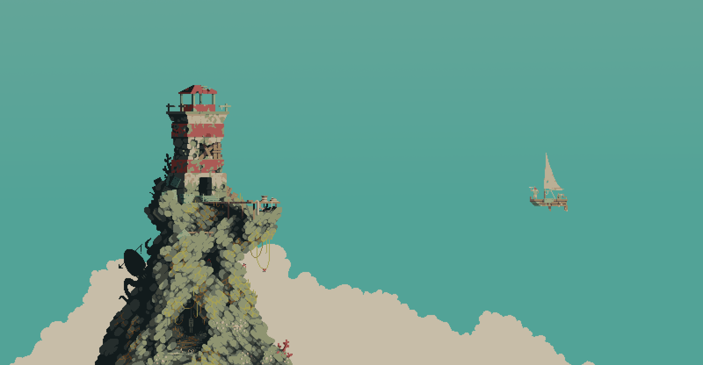
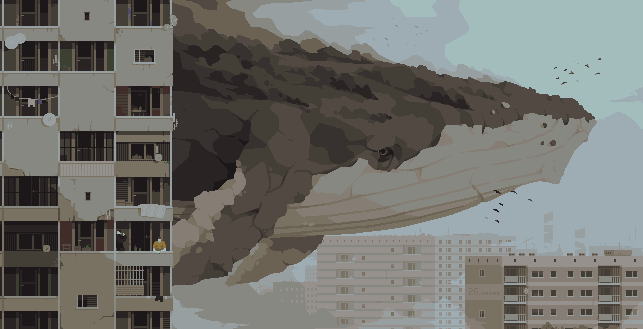
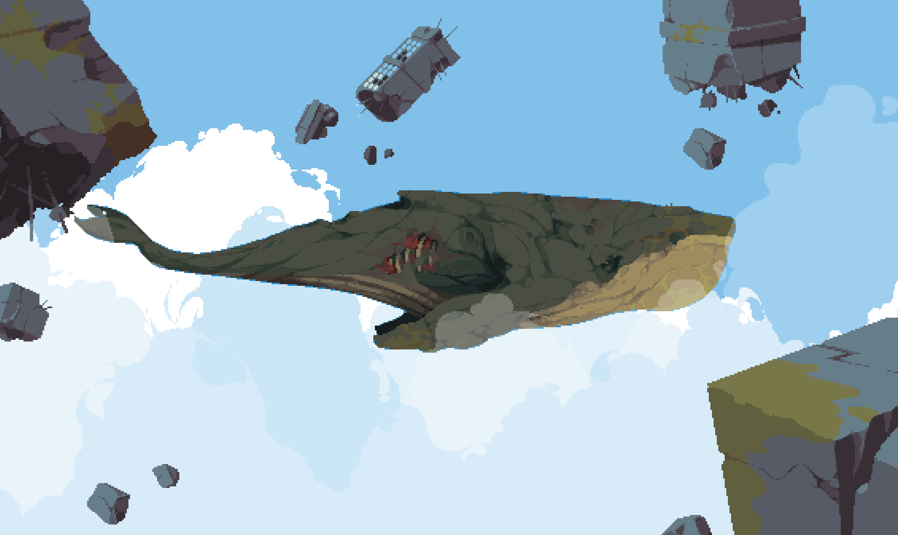
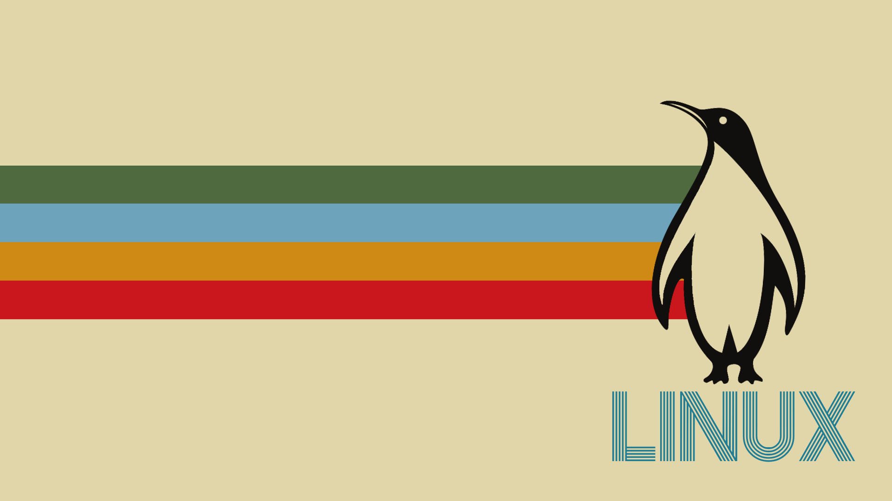

# Jorge Terence's Dotfiles

<!-- Preview -->

## About

Here you'll find:

- A tasty Manjaro rice 🍙
- The apps and services I use for studying, development and daily life 📚
- An environment ready for Python, Node.js, Rust and Go development 🧑‍💻

## Apps and Programs

| Program        | Name           |
| -------------- | -------------- |
| Terminal       | Kitty          |
| Shell          | Fish           |
| Prompt         | Starship       |
| Editor         | VSCode + Micro |
| Window Manager | Qtile          |
| Compositor     | Picom          |
| Launcher       | Rofi           |

## Setup

I'm using [`dotbot`](https://github.com/anishathalye/dotbot) for managing symlinks

```sh
yay -S git base-devel fish
pip install dotbot

git clone 'https://github.com/JorgeTerence/Dotfiles'
cd Dotfiles

dotbot -c install.conf.yaml
./install.fish
```

## Post-install

- Install the [SimplerentFox](https://addons.mozilla.org/en-US/firefox/addon/simplerentfox) Firefox theme.
- Log in to VSCode, Thunderbird, Discord, Steam and MS Teams.
- Get GitHub sign-in key

<!-- ## Gallery -->

## Wallpapers

Photo by [Alexander](https://unsplash.com/@blgnlife?utm_source=unsplash&utm_medium=referral&utm_content=creditCopyText) on [Unsplash](https://unsplash.com/?utm_source=unsplash&utm_medium=referral&utm_content=creditCopyText)


Photo by [Matteo Vella](https://unsplash.com/@dragomv?utm_source=unsplash&utm_medium=referral&utm_content=creditCopyText) on [Unsplash](https://unsplash.com/?utm_source=unsplash&utm_medium=referral&utm_content=creditCopyText)


Panels by [Franrekkk](https://www.reddit.com/user/Franrekkk) on [Reddit](https://www.reddit.com/r/pixelart)







Art by [airkewldking](https://www.reddit.com/user/airkewldking) on [Reddit](https://www.reddit.com/r/wallpaper)



## TODO

- [ ] Assets
- [ ] KDE Theme
- [ ] VSCode Keybindings
