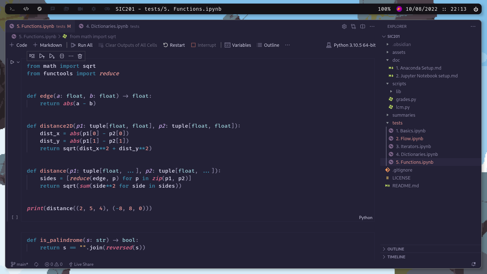
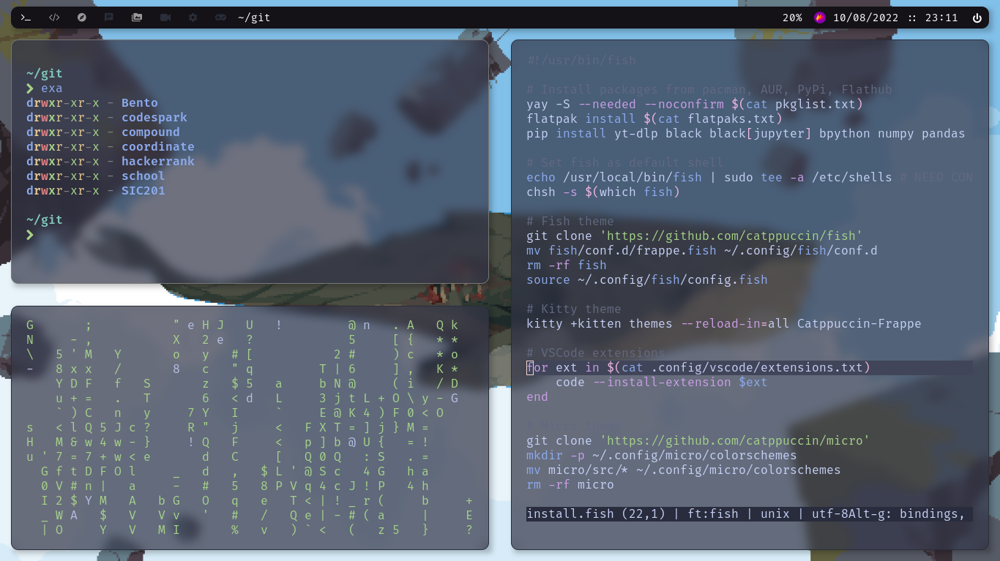

# Jorge Terence's Dotfiles

<!-- Preview -->

## About

Here you'll find:

- A tasty Manjaro rice 🍙
- The apps and services I use for studying, development and daily life 📚
- An environment ready for Python, Node.js, Rust and Go development 🧑‍💻

## Apps and Programs

| Program        | Name           |
| -------------- | -------------- |
| Terminal       | Kitty          |
| Shell          | Fish           |
| Prompt         | Starship       |
| Editor         | VSCode + Micro |
| Window Manager | Qtile          |
| Compositor     | Picom          |
| Launcher       | Rofi           |

## Setup

I'm using [`dotbot`](https://github.com/anishathalye/dotbot) for managing symlinks

```sh
sudo pacman -Syu --noconfirm # Go do something else
sudo pacman -S git fish python-pip --noconfirm
pyhton3 -m pip install dotbot

git clone 'https://github.com/JorgeTerence/Dotfiles'
cd Dotfiles

pyhton3 -m dotbot -c install.conf.yaml
./install.fish
```

## Post-install

- Install and set up [https://github.com/ranmaru22/firefox-vertical-tabs](Firefox Vertical Tabs)
- Install San Francisco font and set as system font
- Log in to VSCode, Thunderbird, Discord, Teams etc.

## Gallery





## Wallpapers

Panels by [Franrekkk](https://www.reddit.com/user/Franrekkk)


## TODO

- [ ] KDE Theme
- [ ] VSCode Keybindings
