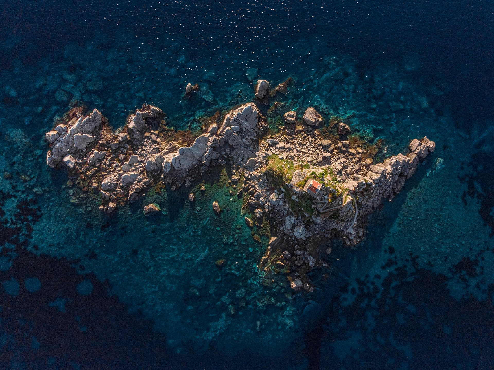

# Jorge Terence's Dotfiles

_This projects uses [dotbot](https://github.com/anishathalye/dotbot)_

## Setup

```sh
git clone 'https://github.com/JorgeTerence/dotfiles'
cd dotfiles

pip install dotbot
dotbot -c install.conf.yaml
```

## Post-install

- Install the [SimplerentFox](https://addons.mozilla.org/en-US/firefox/addon/simplerentfox) Firefox theme.
- Log in to VSCode, Thunderbird, Discord, Steam and MS Teams.
- Get GitHub sign-in key

## Wallpapers

Photo by [Alexander](https://unsplash.com/@blgnlife?utm_source=unsplash&utm_medium=referral&utm_content=creditCopyText) on [Unsplash](https://unsplash.com/?utm_source=unsplash&utm_medium=referral&utm_content=creditCopyText)



Photo by [Matteo Vella](https://unsplash.com/@dragomv?utm_source=unsplash&utm_medium=referral&utm_content=creditCopyText) on [Unsplash](https://unsplash.com/?utm_source=unsplash&utm_medium=referral&utm_content=creditCopyText)


Panels by [Franrekkk](https://www.reddit.com/user/Franrekkk) on [Reddit](https://www.reddit.com/r/pixelart)


Art by [airkewldking](https://www.reddit.com/user/airkewldking) on [Reddit](https://www.reddit.com/r/wallpaper)


## TODO

- [ ] Assets
- [ ] KDE Theme
- [ ] VSCode Keybindings
